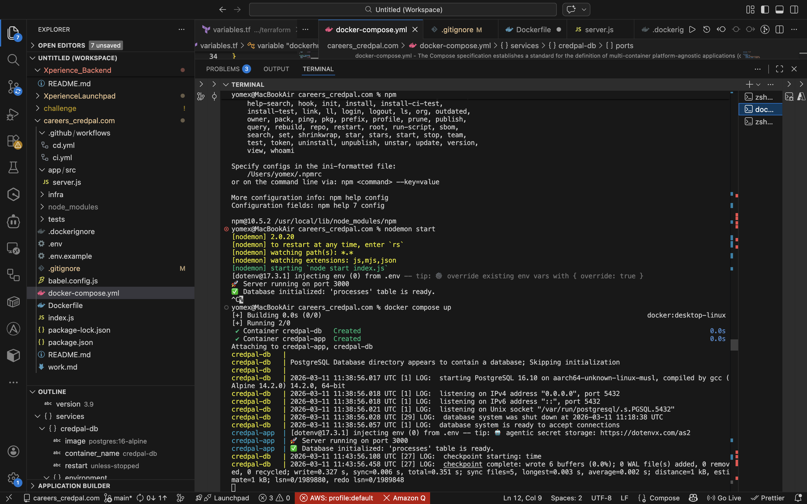
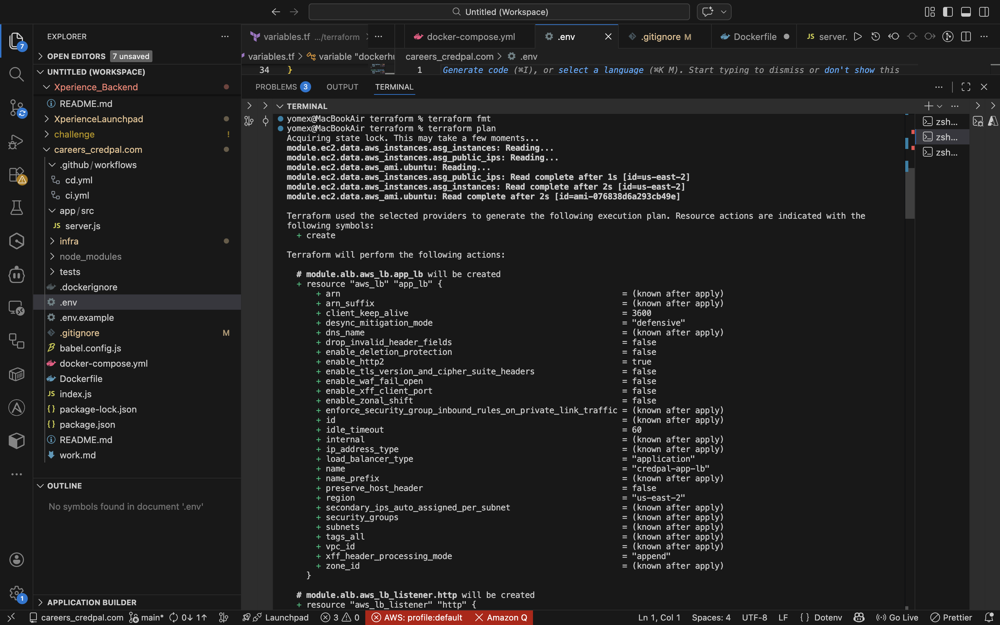
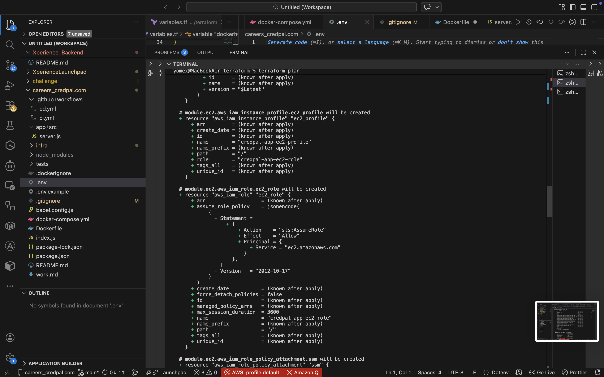
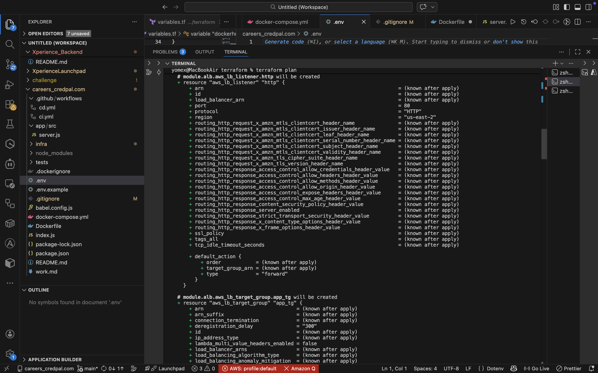

[](https://github.com/yomex96/careers_credpal.com/actions/workflows/ci.yml)


## CredPal Careers Application
```markdown
A production-ready Node.js API service with PostgreSQL database, containerized with Docker and deployed on AWS infrastructure using Infrastructure as Code principles.
```

## 📋 Table of Contents
- [Architecture Overview](#architecture-overview)
- [Tech Stack](#tech-stack)
- [Local Development](#local-development)
- [API Reference](#api-reference)
- [Testing](#testing)
- [Deployment Guide](#deployment-guide)
- [Infrastructure](#infrastructure)
- [CI/CD Pipeline](#cicd-pipeline)
- [Security & Observability](#security--observability)
- [Design Decisions](#design-decisions)

## 🏗 Architecture Overview

The CredPal Careers application follows modern DevOps practices with a clear separation of concerns:

```
┌─────────────┐    ┌──────────────┐    ┌─────────────┐
│   Client    │───▶│     ALB      │───▶│   EC2       │
└─────────────┘    └──────────────┘    │  Instance   │
                                        └──────┬──────┘
                                        ┌──────▼──────┐
                                        │  PostgreSQL │
                                        └─────────────┘
```

- **Multi-stage Docker builds** for optimized production images
- **Terraform modules** for reusable infrastructure components
- **Environment-based configuration** (dev/staging/prod)
- **Automated CI/CD** with manual production approval

## 🛠 Tech Stack

| Component | Technology | Purpose |
|-----------|------------|---------|
| **Runtime** | Node.js 20 (Alpine) | Lightweight application server |
| **Framework** | Express.js | REST API framework |
| **Database** | PostgreSQL 15 (Alpine) | Data persistence |
| **Container** | Docker + Docker Compose | Local development |
| **Orchestration** | Docker | Container runtime |
| **Infrastructure** | Terraform | AWS provisioning |
| **CI/CD** | GitHub Actions | Automation pipeline |
| **Testing** | Jest + Supertest | API testing |

## 💻 Local Development

### Prerequisites
- Docker and Docker Compose
- Node.js 20+ (for local development without Docker)
- Git

### Quick Start

1. **Clone the repository**
   ```bash
   git clone https://github.com/yomex96/careers_credpal.com.git
   cd careers_credpal.com
   ```

2. **Configure environment variables**
   ```bash
   cp .env.example .env
   ```
   
   Update `.env` with local credentials:
   ```env
   DB_HOST=localhost
   DB_USER=app
   DB_PASSWORD=changethis123
   DB_NAME=app
   DB_PORT=5432
   PORT=3000
   NODE_ENV=development
   ```

3. **Start with Docker Compose**
   ```bash
   docker compose up --build
   ```
   
   This starts:
   - PostgreSQL database on port 5432
   - Node.js API on port 3000 with hot-reload
  


4. **Run locally without Docker** (optional)
   ```bash
   npm install
   npm run dev
   ```

### Verification

Once running, you should see:
```
[nodemon] 2.0.20
🚀 Server running on port 3000
✅ Database initialized: 'processes' table is ready.
```

## 📡 API Reference

### Base URL
- Local: `http://localhost:3000`
- Production: `https://api.credpal-careers.com`

### Endpoints

| Method | Endpoint | Description | Request Body | Response |
|--------|----------|-------------|--------------|----------|
| GET | `/` | Welcome message | - | `{ "message": "CredPal is Working finally let's go!🚀" }` |
| GET | `/health` | Health check | - | `{ "status": "healthy" }` |
| GET | `/status` | Service information | - | `{ "service": "credpal-app", "uptime": 123.45 }` |
| GET | `/ping` | Connectivity test | - | `{ "pong": true }` |
| GET | `/process` | List all records | - | Array of process records |
| POST | `/process` | Create new record | `{ "data": "string" }` | Created record with timestamp |

### Example Requests

```bash
# Health check
curl http://localhost:3000/health

# Create a process record
curl -X POST http://localhost:3000/process \
  -H "Content-Type: application/json" \
  -d '{"data":"Hello CredPal"}'

# Response
{
  "message": "Request processed successfully",
  "record": {
    "id": 1,
    "data": "Hello CredPal",
    "created_at": "2024-01-01T00:00:00.000Z"
  },
  "timestamp": "2024-01-01T00:00:00.000Z"
}
```

## 🧪 Testing

### Run Tests
```bash
# Run all tests
npm test

# Run with coverage
npm run test:coverage

# Run in watch mode
npm run test:watch
```

### Test Coverage
```
PASS  tests/health.test.js
  CredPal API Endpoints
    ✓ GET /health returns healthy status
    ✓ GET /status returns service info
    ✓ POST /process adds data successfully
    ✓ POST /process returns 400 for missing data

Test Suites: 1 passed, 1 total
Tests:       4 passed, 4 total
```

## 🚀 Deployment Guide

### Branch Strategy

| Branch | Environment | Purpose | CI/CD Action |
|--------|-------------|---------|--------------|
| `dev` | Development | Feature development | Run tests + build |
| `main` | Staging | Integration testing | Run tests + build |
| `prod` | Production | Live environment | Manual approval + deploy |

### Deployment Process

1. **Development** (automatic on push to `dev`)
   - Code is tested and built
   - Docker image is created but not deployed

2. **Staging** (automatic on push to `main`)
   - Full test suite runs
   - Docker image is pushed to registry

3. **Production** (manual approval required)
   - Create PR from `main` to `prod`
   - GitHub environment requires manual approval
   - Terraform applies infrastructure changes
   - Application deploys to AWS

## 🏗 Infrastructure

### Terraform Modules

```
infra/terraform/
├── modules/
│   ├── vpc/           # VPC, subnets, internet gateway
│   ├── security_group/ # Security groups and rules
│   ├── alb/           # Application Load Balancer
│   └── ec2/           # EC2 instances and auto-scaling
├── main.tf            # Main configuration
├── variables.tf       # Input variables
├── outputs.tf         # Output values
└── backend.tf         # Remote state configuration
```





### Infrastructure Components

- **VPC**: Isolated network with public subnets
- **ALB**: Load balancing with HTTPS termination
- **EC2**: Application instances running Docker
- **Security Groups**: Fine-grained access control
- **S3**: Terraform state storage
- **DynamoDB**: State locking for concurrent operations

### Remote State Management
```hcl
terraform {
  backend "s3" {
    bucket         = "credpal-terraform-state"
    key            = "prod/terraform.tfstate"
    region         = "us-east-1"
    dynamodb_table = "terraform-state-lock"
    encrypt        = true
  }
}
```

## 🔄 CI/CD Pipeline

### GitHub Actions Workflow

```yaml
name: CI/CD Pipeline

on:
  push:
    branches: [dev, main]
  pull_request:
    branches: [main]
  workflow_dispatch:

jobs:
  test:
    runs-on: ubuntu-latest
    steps:
      - uses: actions/checkout@v3
      - name: Run tests
        run: |
          npm ci
          npm test

  build:
    needs: test
    runs-on: ubuntu-latest
    steps:
      - name: Build and push Docker image
        uses: docker/build-push-action@v4
        with:
          push: true
          tags: yomex96/credpal-app:latest

  deploy-prod:
    needs: build
    if: github.ref == 'refs/heads/prod'
    environment: production
    runs-on: ubuntu-latest
    steps:
      - name: Terraform Apply
        run: |
          terraform init
          terraform apply -auto-approve
```

### Docker Multi-stage Build

```dockerfile
# Build stage
FROM node:20-alpine AS build
WORKDIR /app
COPY package*.json ./
RUN npm ci
COPY . .

# Production stage
FROM node:20-alpine AS runtime
RUN apk add --no-cache tini
RUN addgroup -S appgroup && adduser -S appuser -G appgroup
WORKDIR /app
COPY --from=build --chown=appuser:appgroup /app ./
RUN npm ci --only=production
USER appuser
EXPOSE 3000
HEALTHCHECK --interval=30s --timeout=5s CMD wget -qO- http://localhost:3000/health || exit 1
ENTRYPOINT ["/sbin/tini", "--"]
CMD ["node", "index.js"]
```

## 🔒 Security & Observability

### Security Measures
- ✅ **No secrets in code** - All secrets via environment variables
- ✅ **Non-root user** - Container runs as `appuser`
- ✅ **HTTPS termination** - At ALB level
- ✅ **Minimal base images** - Alpine Linux for reduced attack surface
- ✅ **Proper signal handling** - Tini init system
- ✅ **Security groups** - Least privilege access

### Observability
- 📊 **Health checks** - `/health` endpoint for container orchestration
- 📝 **Structured logging** - JSON format logs for easy parsing
- 🔍 **Request tracking** - Request IDs for traceability
- 🚦 **Graceful shutdown** - Proper SIGTERM handling

### Monitoring Endpoints
- `/health` - Container health (returns 200/500)
- `/status` - Service information and uptime

## 💡 Design Decisions

### Infrastructure Choices
1. **Terraform over CloudFormation**
   - Provider-agnostic, reusable modules
   - Better state management with remote backends
   - Larger community and module ecosystem

2. **ALB over Nginx**
   - Managed service reduces operational overhead
   - Built-in HTTPS termination
   - Integrated with AWS WAF for future security needs

### Application Architecture
1. **Multi-stage Docker builds**
   - Smaller production images (from 1GB to <150MB)
   - Better layer caching for faster builds
   - Separation of build and runtime dependencies

2. **Environment-based configuration**
   - Different settings per environment
   - No code changes between environments
   - Easy local development

3. **Manual production approval**
   - Prevents accidental deployments
   - Allows for final verification
   - Audit trail for compliance

### CI/CD Decisions
- **Separate branches** for clear environment promotion
- **GitHub Environments** for approval gates
- **Remote state locking** prevents concurrent modifications
- **Automated testing** before any deployment

## This README addresses Part 6 – Documentation:

- How to run the application locally ✅
- How to access the app ✅
- How to deploy the application ✅
- Key decisions for security, CI/CD, and infrastructure ✅

##  ✅ Assessment Checklist Coverage

Part 1 – Containerization: Multi-stage Docker build, non-root user, Docker Compose for app + PostgreSQL ✅

Part 2 – CI/CD: GitHub Actions pipeline for push & PR, runs tests, builds Docker image, pushes to registry ✅

Part 3 – Infrastructure as Code: Terraform modules for VPC, EC2, ALB, security groups, HTTPS certificate ✅

Part 4 – Deployment Strategy: Zero-downtime deployment (Auto Scaling Group), manual approval for prod ✅

Part 5 – Security & Observability: Secrets via environment vars, HTTPS at ALB, non-root container, health checks, logging ✅

Part 6 – Documentation: README explains local setup, API access, deployment, and key design decisions ✅

## 📝 License

This project is proprietary and confidential.

## 👥 Author

- Abayomi Robert Onawole
- [yomex96](https://github.com/yomex96)
- - [Linkedin](https://www.linkedin.com/in/abayomi-robert-onawole/)


